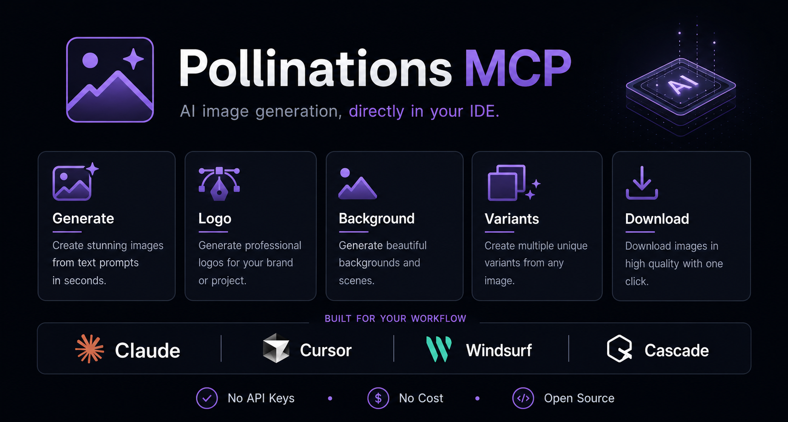

# 🎨 Pollinations MCP

<div align="center">



<div align="center">

[](https://www.npmjs.com/package/pollinations-mcp)
[](LICENSE)
[]()
[]()

**Free AI image generation MCP server for Claude Desktop, Cursor, Windsurf, Cascade, and any MCP client.**

*Powered by [Pollinations.ai](https://pollinations.ai) — no API key, no cost, no limits.*

</div>

---

## ✨ Features

- 🚀 **Instant Image Generation** — Create any image from a text prompt
- 🎯 **Smart Auto-Size** — Automatically detects best dimensions (logo, hero, banner, etc.)
- 🔄 **Variants Generator** — Generate 2-5 variations for A/B testing
- 📥 **Local Download** — Auto-saves images to local `images/` folder
- 🌐 **Multi-Platform** — Works with Claude Desktop, Cursor, Windsurf, Cascade
- 💰 **Completely Free** — No API key required

---

## 🛠️ Tools Available

| Tool | Description |
|------|-------------|
| `generate_image` | Generate any image from a text prompt |
| `generate_logo` | Create logos with brand-aware prompt building |
| `generate_background` | Generate hero/section/card backgrounds |
| `generate_variants` | Create 2-5 variants with different seeds |
| `download_image` | Download image to local folder |

---

## 🚀 Quick Setup

### 1. Install

```bash
# Clone or download this repo
cd pollinations-mcp
npm install
```

### 2. Configure

Add to your MCP config file:

**Windows**
```powershell
# Find your config at:
%APPDATA%\Claude\claude_desktop_config.json    # Claude Desktop
%APPDATA%\Cursor\mcp_config.json                # Cursor
%APPDATA%\Windsurf\mcp_config.json              # Windsurf
%APPDATA%\Cascade\mcp_config.json               # Cascade
```

**macOS / Linux**
```bash
~/Library/Application Support/Claude/           # Claude Desktop
~/.config/Cursor/                               # Cursor
~/.config/Windsurf/                             # Windsurf
~/.config/Cascade/                              # Cascade
```

Add this to your config:

```json
{
  "mcpServers": {
    "pollinations": {
      "command": "node",
      "args": ["PATH_TO_YOUR/pollinations-mcp/index.js"]
    }
  }
}
```

> 💡 **Tip:** Use absolute paths. On Windows, use forward slashes `/` or double-escaped backslashes `\\`

### 3. Restart & Use

Restart your app and start generating images!

---

## 📝 Usage Examples

```
Generate a minimalist logo for "AlgoBnb" in blue and white, tech industry

Create a dark abstract hero background with geometric shapes, futuristic mood

Generate 3 variants of a gradient mesh background for a SaaS landing page

Create a YouTube thumbnail for a coding tutorial, dark theme with neon accents

Generate an app icon for a fitness app, modern and energetic style
```

---

## 🎨 Models

| Model | Best For |
|-------|----------|
| `flux` | General purpose (default) |
| `flux-realism` | Photorealistic images |
| `flux-anime` | Anime & illustrations |
| `flux-3d` | 3D render style |
| `turbo` | Fast generation |

---

## 📐 Auto-Size Reference

The tool automatically detects the best size based on your prompt:

| Prompt Keywords | Size |
|-----------------|------|
| logo, icon, favicon | 512×512 |
| avatar, profile | 512×512 |
| instagram, social media | 1080×1080 |
| twitter, tweet | 1200×675 |
| youtube thumbnail | 1280×720 |
| hero, header | 1920×1080 |
| background, wallpaper | 1920×1080 |
| banner, ad | 1200×628 |
| story | 1080×1920 |
| *(default)* | 1024×1024 |

---

## 📂 Local Image Storage

All generated images are automatically saved to the `images/` folder next to `index.js`.

---

## 🔧 How It Works

1. Pollinations.ai generates images from prompts — no API key needed
2. Images are automatically saved to local `images/` folder
3. Same prompt + same seed = same image (deterministic)
4. Use URLs directly in `` tags or download via the tool

---

## 📄 License

ISC License — © [Atia Hegazy](https://atiaeno.com)